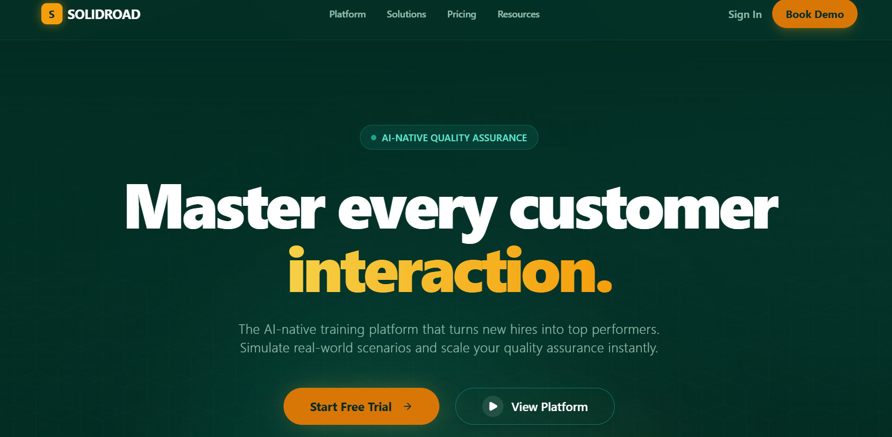
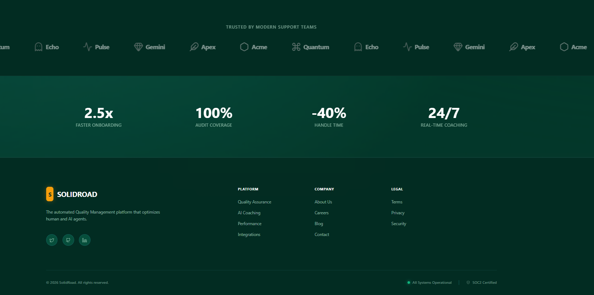

# Solidroad Landing Page Recreation (TanStack Start)

<div align="center">
  
</div>

---

## 📋 Project Overview

This project is a frontend assessment submission that recreates the **Hero** and **Footer** sections of the Solidroad website.

Built strictly using **TanStack Start** and **Shadcn UI**, this project demonstrates modern full-stack React capabilities, responsive design, and creative adaptation. Per the **"Creative Freedom"** requirement, this implementation features a **custom Dark Mode / Cyberpunk Green aesthetic** rather than a pixel-perfect copy of the original light theme.

**🔗 Repository Link:** [https://github.com/bolla-geethika/full-stack-assessment](https://github.com/bolla-geethika/full-stack-assessment)

---

## 🚀 Tech Stack

| Component | Technology | Description |
| :--- | :--- | :--- |
| **Framework** | [TanStack Start](https://tanstack.com/start/latest) | File-based routing, SSR, and modern React patterns |
| **UI Library** | [Shadcn UI](https://ui.shadcn.com/) | Accessible components based on Radix Primitives |
| **Styling** | [Tailwind CSS](https://tailwindcss.com/) | Utility-first CSS framework for responsive design |
| **Language** | [TypeScript](https://www.typescriptlang.org/) | Strongly typed JavaScript for code reliability |
| **Icons** | [Lucide React](https://lucide.dev/) | Clean, consistent SVG icons |

---

## 🛠️ Setup Instructions

Follow these steps to run the project locally on your machine.

1.  **Clone the repository**
    ```bash
    git clone [https://github.com/bolla-geethika/full-stack-assessment.git](https://github.com/bolla-geethika/full-stack-assessment.git)
    cd full-stack-assessment
    ```

2.  **Install dependencies**
    *Note: This project uses `package.json` for dependency management.*
    ```bash
    npm install
    ```

3.  **Run the development server**
    ```bash
    npm run dev
    ```

4.  **View the application**
    Open [http://localhost:5173](http://localhost:5173) in your browser.

---

## 📸 Screenshots

### Hero Section
*A high-impact landing area featuring a modern dark theme with vivid green accents, responsive typography, and functional CTA buttons.*


### Footer Section
*A fully responsive 4-column footer with branding, social links, and organized navigation.*



---

## ✨ Key Features & Creative Interpretation

In compliance with the assessment's "Creative Freedom" clause, the following enhancements were implemented:

* 🎨 **Dark Mode Theme:** Switched from the original light theme to a **"Cyber-Green" palette** (Dark Background + Emerald Accents) to demonstrate design sensibility.
* 🖱️ **Interactive Elements:** Added hover states (`hover:scale-105`), smooth transitions, and micro-interactions to all buttons and links.
* 📱 **Responsive Layout:** Implemented a mobile-first approach using Tailwind Grid and Flexbox, ensuring perfect rendering on Mobile, Tablet, and Desktop.
* 🧩 **Semantic Structure:** Code is organized into modular, reusable components (`Hero.tsx`, `Footer.tsx`) within the `src/components/ui` directory.

---

## 📂 Project Structure

```text
src/
├── components/
│   └── ui/          # Reusable Shadcn components & Page Sections
│       ├── button.tsx
│       ├── Hero.tsx
│       └── Footer.tsx
├── routes/
│   └── index.tsx    # Main Homepage Route
├── styles.css       # Global Tailwind Directives
└── main.tsx         # Application Entry Point
